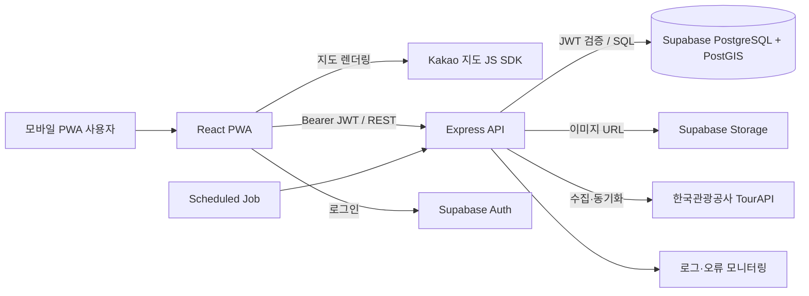
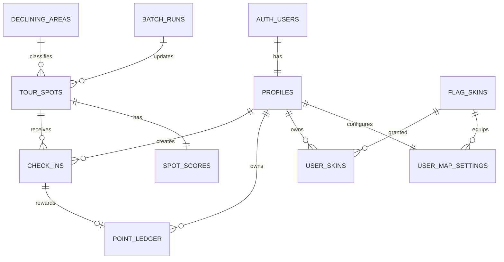

# Local Flag 프로젝트 기획 및 개발 명세

> 버전: v0.1  
> 작성일: 2026-08-16  
> 대상: 기획·도메인 팀장 1명, 백엔드 1명, 프론트엔드 1명, UI/UX 1명

## 0. 문서 목적과 작성 기준

이 문서는 첨부 자료 `1.pdf`, `페르소나 아이디어 (1).docx`에서 프로젝트와 관련된 아이디어, 페르소나, UX, 데이터 수집, 점수 정책을 추려 Local Flag의 MVP 실행 명세로 재구성한 문서다. 첨부 자료에 포함된 대화형 요청 문장이나 다른 목적의 작성 지시는 프로젝트 요구사항으로 취급하지 않았다.

이 문서에서 합의가 필요한 항목은 **결정 필요**, MVP 이후로 미룬 항목은 **Post-MVP**로 표시한다.

---

## 1. 프로젝트 한눈에 보기

### 1.1 한 문장 소개

Local Flag는 유명 관광지에 과도하게 집중된 관광 수요를 분산하기 위해, 사용자가 잘 알려지지 않은 로컬 명소를 발견하고 현장에서 인증하면 포인트와 나만의 깃발 기록을 제공하는 위치 기반 관광 서비스다.

### 1.2 해결하려는 문제

- 검색 결과가 광고성 콘텐츠와 유명 관광지에 집중되어 숨은 장소를 찾기 어렵다.
- 유명 관광지는 혼잡, 웨이팅, 바가지와 같은 피로를 유발한다.
- 여행을 자주 다닌 사용자는 새로운 목적지와 수집 동기가 부족하다.
- 기존 스탬프 투어는 일회성 보상에 머물러 재방문 동기가 약하다.
- 인구감소지역과 덜 알려진 관광 자원은 방문객에게 노출될 기회가 부족하다.

### 1.3 핵심 가치

| 사용자 가치 | 지역 가치 | 서비스 가치 |
|---|---|---|
| 한적한 장소 발견, 여행 목표, 수집 재미, 포인트 보상 | 관광 수요 분산, 지역 방문 유도, 숨은 자원 노출 | 발견 → 현장 인증 → 기록·꾸미기 → 다음 발견의 반복 |

### 1.4 제품 원칙

1. **발견 우선:** 앱 첫 화면에서 사용자의 현재 위치만 보여주지 않고 전국의 숨은 장소를 탐색하게 한다.
2. **현장성:** 포인트는 서버가 검증한 현장 방문에만 지급한다.
3. **공정성:** 유명·혼잡 장소보다 한적한 지역과 숨은 장소에 더 큰 동기를 부여한다.
4. **수집의 지속성:** 인증 결과를 개인 지도와 깃발 컬렉션으로 남긴다.
5. **설명 가능한 보상:** 장소 등급과 포인트 산정 이유를 사용자가 이해할 수 있게 표시한다.
6. **최소 위치 수집:** 상시 추적 없이 인증 시점의 위치만 필요한 범위에서 처리한다.

---

## 2. 목표 사용자와 핵심 시나리오

### 2.1 우선 페르소나

#### Primary - 숨은 장소를 찾는 힐링·힙스터형 여행자

- 예시: 김아영, 20대 후반 직장인
- 주말마다 외곽으로 떠나며 붐비는 핫플보다 조용하고 감성적인 로컬 장소를 선호한다.
- 광고성 블로그와 반복되는 유명 명소 추천에 피로를 느낀다.
- 여행 전 집이나 회사에서 앱을 열어 전국 단위로 목적지를 탐색한다.
- 방문 기록을 감성적인 지도와 깃발로 꾸미고 공유하고 싶어 한다.

#### Secondary - 도장 깨기형 여행자

- 이미 유명 관광지를 많이 방문해 새로운 여행 목표가 필요하다.
- 희귀 장소, 지역 완주, 깃발 컬렉션과 같은 수집 요소에 반응한다.

#### Tertiary - 혜택 중심 알뜰 여행자

- 포인트, 스탬프 투어, 지역 혜택을 적극적으로 이용한다.
- 보상이 작거나 일회성이면 앱을 계속 사용할 이유를 느끼지 못한다.

### 2.2 핵심 사용자 여정

1. 사용자가 전국 지도 또는 추천 리스트에서 숨은 장소를 발견한다.
2. 상세 정보, 장소 등급, 예상 보상, 운영 정보를 확인한다.
3. 목적지에 도착해 현장 인증 탭을 연다.
4. 100m 인증 범위와 GPS 정확도 검증을 통과한다.
5. 서버가 중복·속도·일일 한도 등 부정행위를 검사한다.
6. 인증 성공과 함께 포인트가 원장에 적립되고 기본 깃발이 지도에 꽂힌다.
7. 사용자는 마이 플래그에서 기록을 꾸미고 다음 추천 장소를 탐색한다.

---

## 3. MVP 범위

### 3.1 반드시 구현

- Supabase Auth 기반 회원가입, 로그인, 로그아웃
- 전국 지도와 추천 리스트를 오가는 탐색 화면
- 관광지 핀, 검색·필터, 상세 정보
- 현재 위치 권한과 주변 인증 가능 장소 표시
- 반경 100m 현장 인증
- 장소 등급과 방문 보상 포인트 계산
- 포인트 잔액과 적립 내역
- 방문한 장소가 표시된 마이 플래그 지도
- 기본 깃발 스킨 선택·장착
- TourAPI 수집·정제·스코어링 배치
- 기본 어뷰징 방지와 감사 로그
- 이미지가 없는 장소의 fallback UI

### 3.2 MVP에서 제외

- 실제 지역화폐 전환과 현금성 출금
- 상시 GPS 추적, 이동 경로 저장
- 실시간 유동인구·혼잡도 외부 API 연동
- PWA에서 신뢰성 있게 구현하기 어려운 루팅·탈옥 탐지
- 팀 점령전, 실시간 랭킹, 소셜 피드
- 지자체·브랜드 스폰서드 핀 관리 화면
- 푸시 알림, 장시간 체류 보너스, 숙박 연계
- 사용자가 임의의 비관광지에 핀을 생성하는 기능

### 3.3 MVP 성공 지표

| 지표 | 정의 | 초기 목표 |
|---|---|---:|
| 탐색 활성화율 | 가입 후 24시간 안에 장소 상세를 1회 이상 조회한 비율 | 60% 이상 |
| 인증 성공률 | 인증 시도 중 정상 성공 비율 | 80% 이상 |
| 숨은 지역 방문 비율 | 인구감소지역 또는 B/A/S 등급 장소 인증 비율 | 40% 이상 |
| 7일 재방문율 | 첫 인증 후 7일 안에 다시 접속한 사용자 비율 | 25% 이상 |
| 부정 적립률 | 사후 검토에서 부정으로 확인된 포인트 비율 | 1% 미만 |
| API 성능 | 주요 조회 API의 p95 응답 시간 | 800ms 이하 |

---

## 4. 정보 구조와 핵심 화면

### 4.1 하단 3탭

| 탭 | 목적 | 핵심 기능 |
|---|---|---|
| 탐색 `Discovery` | 여행 전 목적지 발견 | 전국 지도, 지도/리스트 토글, 검색, 카테고리·등급·지역 필터, 추천 장소 |
| 현장 인증 `Check-in` | 여행지 도착 후 방문 증명 | 현재 위치 중심 지도, 인증 가능 핀 강조, 거리·GPS 상태, 인증 버튼 |
| 마이 플래그 `My Flag` | 기록과 보상 관리 | 방문 지도, 포인트 잔액·내역, 깃발 스킨, 방문 컬렉션 |

### 4.2 화면 목록

| ID | 화면 | 주요 상태와 예외 |
|---|---|---|
| A-01 | 온보딩·로그인 | 로그인 실패, 약관 동의, 위치 권한 안내 |
| D-01 | 전국 탐색 지도 | 로딩, 핀 없음, 지도 영역 변경, 클러스터링, API 오류 |
| D-02 | 추천 리스트 | 필터 결과 없음, 이미지 fallback, 무한 스크롤 |
| D-03 | 장소 상세 | 운영 종료, 시즌 핀 대기/만료, 예상 보상, 길찾기 |
| C-01 | 현장 인증 지도 | 위치 권한 거부, GPS 정확도 부족, 범위 밖, 이미 인증함 |
| C-02 | 인증 결과 | 성공 애니메이션, 적립 포인트, 무보상 재방문, 심사 보류 |
| M-01 | 마이 플래그 지도 | 빈 상태, 방문 핀, 스킨 적용, 필터 |
| M-02 | 포인트 내역 | 적립·차감·취소, 페이지네이션 |
| M-03 | 깃발 스킨 | 보유/미보유, 구매, 장착, 잔액 부족 |

### 4.3 핵심 UX 규칙

- 첫 화면은 전국 단위 탐색으로 시작하고, 현재 위치 이동 버튼을 별도로 제공한다.
- 지도와 리스트는 같은 필터 상태를 공유한다.
- 인증 가능 범위에 들어오면 핀과 버튼을 색상·진동·텍스트로 함께 강조한다.
- 인증 실패 시 “실패”만 표시하지 않고 남은 거리, GPS 정확도, 재시도 방법을 안내한다.
- 장소 등급과 예상 포인트의 산정 이유를 툴팁이나 바텀시트로 공개한다.
- 지도에 너무 많은 커스텀 오버레이를 한 번에 표시하지 않고 줌 레벨별 클러스터링을 적용한다.

---

## 5. 권장 기술 스택과 시스템 구조

### 5.1 기술 스택

| 영역 | 선택 | 역할 |
|---|---|---|
| Frontend | React + Vite + TypeScript | 모바일 우선 반응형 PWA |
| UI | Tailwind CSS + Lucide Icons | 공통 컴포넌트와 아이콘 |
| Server State | TanStack Query | API 캐시, 재시도, 로딩 상태 |
| Client State | Zustand | 지도 모드, 필터, 임시 UI 상태 |
| Map | Kakao 지도 JavaScript SDK | 지도, 커스텀 오버레이, 위치 표시 |
| Backend | Node.js + Express + TypeScript | REST API, 검증, 포인트 트랜잭션, 배치 |
| Database | Supabase PostgreSQL + PostGIS | 인증 연계 데이터, 공간 조회, 포인트 원장 |
| Auth/Storage | Supabase Auth + Storage | 사용자 인증, 깃발·fallback 이미지 |
| External Data | 한국관광공사 국문 관광정보 서비스 | 관광 POI, 상세, 이미지, 행사 데이터 |
| Deploy | Vercel(FE) + Render(BE) | HTTPS 배포와 Git 연동 |
| Contract/Test | OpenAPI 3.1 + Vitest + Supertest | FE/BE 계약, 단위·통합 테스트 |

> 백엔드는 팀의 Python 숙련도가 압도적으로 높다면 FastAPI로 교체할 수 있다. 단, 한 명의 백엔드가 운영하므로 MVP 도중 Express와 FastAPI를 혼용하지 않는다.

### 5.2 논리 아키텍처



### 5.3 설계 원칙

- TourAPI 인증키와 Supabase service role key는 백엔드에만 저장한다.
- 프론트엔드는 장소 조회와 인증을 반드시 Local Flag API를 통해 수행한다.
- 포인트 변경은 `point_ledger`에 append-only 방식으로 기록하고 직접 잔액을 수정하지 않는다.
- 위치 비교와 범위 검색은 PostGIS의 `geography(Point, 4326)`와 GiST 인덱스를 사용한다.
- 모든 시간은 DB에 UTC로 저장하고 UI에서 KST로 표시한다.
- 외부 API 응답은 `raw_json`으로 보관하되, 서비스 조회는 정규화한 컬럼을 사용한다.

---

## 6. TourAPI 데이터 파이프라인

### 6.1 공식 오퍼레이션

첨부 자료의 초기 부분에는 `areaBasedList1`, `locationBasedList1`이 섞여 있으나, 구현 기준은 현재 공공데이터포털에 공개된 `*2` 오퍼레이션으로 통일한다.

- 목록: `areaBasedList2` 또는 변경분 동기화용 `areaBasedSyncList2`
- 위치 기반 확인: `locationBasedList2`
- 공통 정보: `detailCommon2`
- 소개 정보: `detailIntro2`
- 반복 정보: `detailInfo2`
- 이미지: `detailImage2`
- 행사: `searchFestival2`

### 6.2 수집 대상

| contentTypeId | 카테고리 | MVP 처리 |
|---:|---|---|
| 12 | 관광지 | 핵심 핀 |
| 14 | 문화시설 | 핵심 핀 |
| 15 | 행사·공연·축제 | 시즌 핀 |
| 28 | 레포츠 | 체험형 핀 |
| 32 | 숙박 | 정보 제공, MVP 포인트 대상은 **결정 필요** |
| 38 | 쇼핑 | 보조 핀, 초기 지도 노출은 **결정 필요** |
| 39 | 음식점 | 보조 핀, 지역·수량 제한 필요 |
| 25 | 여행코스 | 단일 좌표 인증과 맞지 않아 MVP 제외 |

### 6.3 수집·정제 단계

1. 카테고리별 목록을 페이지 단위로 수집한다.
2. `contentid`를 PK로 사용해 UPSERT한다.
3. `mapx`, `mapy`가 null, 빈 값, 0이면 `INACTIVE` 처리한다.
4. 위도 33.0~39.0, 경도 124.0~132.0을 벗어난 좌표를 검토 대상으로 분리한다.
5. 상세·이미지 정보를 가져와 정규화 컬럼과 `raw_json`에 저장한다.
6. 장소 등급 점수를 계산하고 지도 노출 상태를 결정한다.
7. 행사 데이터는 시작일·종료일을 별도 저장해 라이프사이클을 관리한다.

### 6.4 동기화 주기

| 데이터 | 주기 | 방식 |
|---|---|---|
| 일반 장소 | 월 1회 새벽 | `areaBasedSyncList2` 변경분 반영 |
| 행사·축제 | 주 1회 새벽 | `searchFestival2` 시작일·종료일 갱신 |
| 실패 재처리 | 배치 종료 후 | 지수 백오프, 최대 3회, dead-letter 기록 |

### 6.5 시즌 핀 상태

| 시점 | 상태 | 동작 |
|---|---|---|
| D-3 ~ D-1 | `SCHEDULED` | 예고 핀 노출, 인증 불가 |
| D-Day ~ 종료일 | `ACTIVE` | 시즌 핀 인증과 보너스 허용 |
| 종료일 +1일 | `EXPIRED` | 지도 기본 노출과 신규 인증 중단 |

---

## 7. 점수와 포인트 정책

첨부 자료에는 장소의 가치와 사용자가 받는 포인트가 같은 “점수”로 표현된 부분이 있다. 구현에서는 회계와 밸런스를 위해 둘을 분리한다.

### 7.1 장소 등급 점수 `spot_score`

장소 메타데이터로 배치에서 계산하는 정적 값이다. 지도 강조, 등급, 추천에 사용하며 포인트 잔액은 아니다.

```text
spot_score = (100 × W_category) × (1 + W_media + W_detail + W_class)
```

#### 카테고리 가중치

| 카테고리 | W_category |
|---|---:|
| 행사·축제 | 2.0 |
| 관광지 | 1.5 |
| 문화시설 | 1.3 |
| 레포츠 | 1.2 |
| 숙박 | 0.8 |
| 쇼핑 | 0.6 |
| 음식점 | 0.5 |

#### 메타데이터 가점

- `W_media`: 대표 이미지 +0.15, 추가 썸네일 +0.05
- `W_detail`: 상세 필드 5개 이상 +0.20, 3~4개 +0.10, 2개 이하 0
- `W_class`: 국가 지정 문화재·국립공원·유네스코 +0.20, 지역 특화 자원 +0.10, 일반 0

#### 등급

| 점수 | 등급 | 지도 표현 |
|---:|---|---|
| 200 이상 | S | 가장 희귀한 핀 강조 |
| 130~199 | A | 높은 가치 핀 |
| 80~129 | B | 표준 핀 |
| 80 미만 | C | 보조 핀 |

### 7.2 방문 보상 포인트 `reward_points`

현장 인증 때 서버가 계산하는 동적 값이다.

```text
reward_points = clamp(round(100 × W_area × W_quiet), 10, 500)
```

| 요소 | 값 | MVP 판정 기준 |
|---|---|---|
| `W_area` | 1.0 / 1.5 / 2.5 | 광역도시 / 일반 지방 / 검증된 인구감소지역 |
| `W_quiet` | 0.1 / 1.0 / 2.0 | 최근 30일 인증 수의 지역·카테고리별 분위수 |

- 실시간 유동인구 API가 없으므로 MVP의 한적함은 Local Flag 내부 인증 수를 프록시로 사용한다.
- 데이터가 부족한 신규 장소는 `W_quiet = 1.0`으로 시작한다.
- 사용자에게 지급 전 산식과 적용 가중치를 응답에 포함한다.
- 장시간 체류 보너스는 개인정보·배터리·부정행위 위험이 있으므로 Post-MVP 실험으로 분리한다.

### 7.3 적립 제한

- 동일 사용자의 동일 장소 최초 정상 인증에만 기본 포인트를 지급한다.
- 재방문은 기록할 수 있으나 기본 포인트는 0이며, 시즌 이벤트가 명시적으로 허용한 경우만 예외다.
- 하루 최대 보상 인증 10회, 일일 적립 5,000포인트를 초과할 수 없다.
- 모든 지급·취소는 `point_ledger`의 고유 거래로 남긴다.
- 정책 변경 시 기존 거래를 수정하지 않고 보정 거래를 추가한다.

---

## 8. 현장 인증과 어뷰징 방지

### 8.1 인증 입력

- `spotId`
- 위도·경도
- 브라우저가 제공한 `accuracyM`
- 클라이언트 측 측정 시각
- 임의 재전송 방지를 위한 `Idempotency-Key`

### 8.2 서버 검증 순서

1. JWT와 사용자 상태를 확인한다.
2. `Idempotency-Key` 중복 요청이면 최초 응답을 반환한다.
3. 장소가 `ACTIVE`이고 인증 가능한 카테고리인지 확인한다.
4. 위치 측정값이 최신이고 `accuracyM <= 50`인지 확인한다.
5. PostGIS `ST_DWithin`으로 장소 중심 100m 이내인지 확인한다.
6. 동일 장소 최초 보상 여부, 5분 쿨다운, 일일 횟수·포인트 한도를 확인한다.
7. 이전 인증과의 거리/시간으로 계산한 속도가 120km/h를 초과하는지 확인한다.
8. 위험 신호가 낮으면 인증·포인트 원장 기록을 하나의 DB 트랜잭션으로 커밋한다.
9. 위험도가 애매하면 포인트를 즉시 지급하지 않고 `REVIEW` 상태로 저장한다.

### 8.3 위험 신호와 처리

| 코드 | 조건 | 처리 |
|---|---|---|
| `GPS_INACCURATE` | 정확도 50m 초과 | 재측정 안내 |
| `OUT_OF_RANGE` | 장소 반경 100m 밖 | 남은 거리 안내 |
| `COOLDOWN` | 직전 인증 후 5분 미만 | 재시도 가능 시각 반환 |
| `IMPOSSIBLE_SPEED` | 연속 인증 사이 속도 120km/h 초과 | `REVIEW` 또는 무보상 처리 |
| `DAILY_CAP` | 일일 횟수·포인트 한도 초과 | 기록 가능, 포인트 0 |
| `ALREADY_REWARDED` | 동일 장소에 이미 포인트 지급 | 재방문 기록, 포인트 0 |

> 웹 브라우저의 위치만으로 Fake GPS를 완전히 판별할 수는 없다. MVP는 오탐을 줄이는 소프트 검증과 감사 로그에 집중하고, 자동 영구 정지는 도입하지 않는다.

---

## 9. 데이터 모델

### 9.1 ERD



### 9.2 주요 테이블

#### `profiles`

- `id uuid PK/FK -> auth.users.id`
- `nickname varchar(30)`
- `point_balance int` - 원장 합계 캐시, 트랜잭션 안에서만 갱신
- `status enum(ACTIVE, SUSPENDED, DELETED)`
- `created_at`, `updated_at`

#### `tour_spots`

- `content_id bigint PK`
- `content_type_id smallint`
- `title`, `address`, `image_url`, `thumbnail_url`
- `location geography(Point, 4326)` + GiST index
- `area_code`, `sigungu_code`
- `is_declining_area boolean`
- `status enum(SCHEDULED, ACTIVE, INACTIVE, EXPIRED)`
- `event_start_date`, `event_end_date`
- `raw_json jsonb`
- `synced_at`, `created_at`, `updated_at`

#### `spot_scores`

- `content_id PK/FK`
- `category_weight`, `media_weight`, `detail_weight`, `class_weight`
- `spot_score numeric`, `grade char(1)`
- `quiet_weight numeric`
- `score_version varchar(20)`
- `calculated_at`

#### `declining_areas`

- `id uuid PK`
- `area_name`, `sigungu_name`
- `tour_area_code`, `tour_sigungu_code`
- `effective_from`, `effective_to`
- `source`, `verified_at`
- unique(`tour_area_code`, `tour_sigungu_code`, `effective_from`)

#### `check_ins`

- `id uuid PK`
- `user_id`, `content_id`
- `location geography(Point, 4326)`
- `accuracy_m numeric`, `distance_m numeric`
- `client_captured_at`, `created_at`
- `status enum(SUCCESS, REVIEW, REJECTED)`
- `risk_code`, `risk_score`
- `reward_points int`
- `idempotency_key varchar(100)`
- unique(`user_id`, `idempotency_key`)

#### `point_ledger`

- `id uuid PK`
- `user_id`, `check_in_id nullable`
- `type enum(CHECK_IN, PURCHASE, REVERSAL, ADMIN_ADJUSTMENT)`
- `amount int` - 적립 양수, 사용·취소 음수
- `balance_after int`
- `policy_version varchar(20)`
- `metadata jsonb`
- `created_at`

#### `flag_skins`, `user_skins`, `user_map_settings`

- 스킨 가격, 에셋 URL, 활성 상태
- 사용자 보유 스킨과 획득 시각
- 현재 장착한 스킨, 지도 테마

#### `batch_runs`

- 배치 종류, 시작·종료 시각, 성공·실패 건수, 커서, 오류 요약

### 9.3 무결성 규칙

- 포인트 지급과 `point_balance` 갱신은 동일한 DB 트랜잭션으로 처리한다.
- 최초 보상은 부분 unique index로 보장한다: 성공한 기본 보상에 대해 `(user_id, content_id)` 중복 금지.
- `point_balance >= 0`, `reward_points >= 0`, `accuracy_m > 0` 체크 제약을 둔다.
- 인증 위치 원본의 보존 기간은 **결정 필요**이며, 기본 제안은 90일 후 격자화 또는 삭제다.

---

## 10. Local Flag REST API

### 10.1 공통 규칙

- Base URL: `/api/v1`
- 인증: `Authorization: Bearer <Supabase access token>`
- 콘텐츠 타입: `application/json`
- 인증·구매 요청: `Idempotency-Key` 필수
- 페이지네이션: `cursor`, `limit` 방식
- 좌표 순서: API 객체는 `lat`, `lng`; DB Point 생성 시 `lng lat` 순서에 주의한다.
- 성공 응답은 `data`, 목록 부가 정보는 `meta`에 담는다.
- 오류 응답은 안정적인 `code`, 사용자용 `message`, 추적용 `traceId`를 제공한다.

```json
{
  "error": {
    "code": "OUT_OF_RANGE",
    "message": "인증 지점에서 136m 떨어져 있습니다.",
    "details": { "distanceM": 136, "allowedRadiusM": 100 },
    "traceId": "req_01J..."
  }
}
```

### 10.2 엔드포인트 목록

#### 시스템·사용자

| Method | Path | 인증 | 설명 |
|---|---|---:|---|
| GET | `/health` | X | 서버·DB 상태 |
| GET | `/me` | O | 프로필, 포인트, 장착 스킨 |
| PATCH | `/me` | O | 닉네임 등 프로필 수정 |
| GET | `/me/point-ledger` | O | 포인트 적립·사용 내역 |
| GET | `/me/check-ins` | O | 내 방문 기록 |

#### 장소 탐색

| Method | Path | 인증 | 설명 |
|---|---|---:|---|
| GET | `/spots` | 선택 | 지도 bbox 또는 지역·필터 기반 목록 |
| GET | `/spots/{spotId}` | 선택 | 장소 상세와 등급·예상 보상 |
| GET | `/spots/recommendations` | 선택 | 숨은 장소 추천 리스트 |
| GET | `/spots/nearby` | O | 현재 위치 근처 인증 가능 장소 |

`GET /spots` 주요 쿼리:

- `minLat`, `minLng`, `maxLat`, `maxLng` - 지도 영역
- `contentTypeIds=12,14,15,28`
- `grades=S,A,B`
- `decliningArea=true|false`
- `q`, `areaCode`, `sigunguCode`
- `cursor`, `limit`

응답 예시:

```json
{
  "data": [
    {
      "id": 125266,
      "title": "고즈넉한 로컬 명소",
      "contentTypeId": 12,
      "location": { "lat": 34.771, "lng": 127.081 },
      "grade": "A",
      "isDecliningArea": true,
      "estimatedReward": 250,
      "imageUrl": null,
      "status": "ACTIVE"
    }
  ],
  "meta": { "nextCursor": "eyJpZCI6...", "hasNext": true }
}
```

#### 현장 인증

| Method | Path | 인증 | 설명 |
|---|---|---:|---|
| POST | `/check-ins/precheck` | O | 거리·GPS·중복·한도 사전 확인, 포인트 미지급 |
| POST | `/check-ins` | O | 최종 서버 검증 후 인증·포인트 트랜잭션 |
| GET | `/check-ins/{checkInId}` | O | 인증 처리 상태 조회 |

`POST /check-ins` 요청:

```json
{
  "spotId": 125266,
  "position": {
    "lat": 34.771123,
    "lng": 127.081234,
    "accuracyM": 18.4,
    "capturedAt": "2026-08-16T03:20:10.000Z"
  }
}
```

성공 응답:

```json
{
  "data": {
    "checkInId": "8a0de7de-1d94-4ff1-9f47-4d95e7f3aa42",
    "status": "SUCCESS",
    "distanceM": 42.7,
    "reward": {
      "points": 250,
      "balance": 1250,
      "factors": {
        "base": 100,
        "areaWeight": 2.5,
        "quietWeight": 1.0
      },
      "policyVersion": "reward-v1"
    },
    "flag": { "placed": true, "skinId": "default-red" }
  }
}
```

#### 깃발·꾸미기

| Method | Path | 인증 | 설명 |
|---|---|---:|---|
| GET | `/flag-skins` | O | 판매·보유 상태를 포함한 스킨 목록 |
| POST | `/flag-skins/{skinId}/purchase` | O | 포인트로 스킨 구매 |
| PUT | `/me/equipped-flag-skin` | O | 대표 깃발 스킨 장착 |
| GET | `/me/map` | O | 내 방문 핀과 현재 스킨 조회 |

#### 내부 배치·운영

| Method | Path | 호출 주체 | 설명 |
|---|---|---|---|
| POST | `/internal/jobs/tour-spots/sync` | Scheduler | TourAPI 변경분 동기화 |
| POST | `/internal/jobs/festivals/sync` | Scheduler | 시즌 핀 갱신 |
| POST | `/internal/jobs/spot-scores/recalculate` | Scheduler/Admin | 점수 재계산 |
| POST | `/internal/check-ins/{id}/review` | Admin | 보류 인증 승인·거절 |

내부 API는 공개 JWT가 아니라 별도 cron secret 또는 관리 서비스 계정으로 보호한다.

### 10.3 상태 코드

| HTTP | 사용 |
|---:|---|
| 200 | 조회·멱등 재요청 성공 |
| 201 | 인증·구매 생성 성공 |
| 400 | 형식 오류 |
| 401 | 인증 토큰 없음·만료 |
| 403 | 정지 사용자, 내부 API 권한 없음 |
| 404 | 장소·인증 없음 |
| 409 | 중복·이미 보상·상태 충돌 |
| 422 | GPS 정확도·범위·정책 검증 실패 |
| 429 | 요청 속도·일일 한도 초과 |
| 502/503 | 외부 API 또는 일시적 서비스 장애 |

### 10.4 API 계약 관리

- 백엔드가 `openapi.yaml`의 작성 책임자다.
- 프론트엔드는 API 구현 전에 스키마와 오류 코드를 리뷰한다.
- 기획·도메인 팀장은 포인트·상태 전이·문구 의미를 승인한다.
- UI/UX는 각 오류 코드의 사용자 메시지와 복구 동선을 정의한다.
- 계약이 바뀌면 OpenAPI PR을 먼저 병합하고 mock과 클라이언트 타입을 갱신한다.

---

## 11. 협업 구조

### 11.1 역할과 책임

| 역할 | 주 책임 | 주요 산출물 | 최종 승인 영역 |
|---|---|---|---|
| 기획·도메인 팀장 | 문제 정의, 정책, 데이터 기준, 일정·리스크, 발표 | PRD, 가중치 지역 매핑, 정책표, 수용 기준, 발표 자료 | 범위, 포인트 정책, 카테고리, 우선순위 |
| 백엔드 | API, DB, TourAPI, 배치, 위치·어뷰징 검증 | OpenAPI, 마이그레이션, 배치, 테스트, 운영 로그 | 데이터·API 구현 |
| 프론트엔드 | PWA, 지도, 위치 권한, API 연동, 상태 관리 | React 앱, 지도·목록·인증 화면, FE 테스트 | 클라이언트 구현 |
| UI/UX | 사용자 여정, 와이어프레임, 디자인 시스템, 에셋 | Figma, 프로토타입, 마커·fallback·스킨 에셋 | 화면·인터랙션 품질 |

### 11.2 RACI

| 업무 | 기획·도메인 | BE | FE | UI/UX |
|---|:---:|:---:|:---:|:---:|
| MVP 범위·우선순위 | A/R | C | C | C |
| 인구감소지역 매핑 | A/R | C | I | I |
| 장소·포인트 정책 | A/R | C | C | C |
| OpenAPI·DB | C | A/R | C | I |
| TourAPI 파이프라인 | C | A/R | I | I |
| 지도·위치 UX 구현 | C | C | A/R | C |
| 와이어프레임·디자인 시스템 | C | I | C | A/R |
| 통합 테스트 | A | R | R | C |
| 데모·발표 | A/R | C | C | R |

`R`: 실행, `A`: 최종 책임, `C`: 사전 협의, `I`: 결과 공유

### 11.3 작업 흐름

1. 기획·도메인이 사용자 스토리와 수용 기준을 이슈로 등록한다.
2. UI/UX가 주요 상태·예외를 포함한 와이어프레임을 연결한다.
3. BE와 FE가 API 계약을 리뷰하고 `openapi.yaml`을 먼저 확정한다.
4. BE는 실제 API, FE는 mock API로 병렬 개발한다.
5. 기능 브랜치 PR에서 자동 테스트와 상호 리뷰를 통과한다.
6. 통합 환경에서 정상·실패 시나리오를 함께 검증한다.
7. 기획·도메인이 수용 기준을 확인하고 Done으로 이동한다.

### 11.4 Git과 이슈 규칙

- `main`은 항상 배포 가능한 상태로 유지한다.
- 짧은 기능 브랜치를 사용한다: `feat/check-in`, `fix/map-cluster`, `docs/api-contract`.
- PR은 최소 1명의 관련 영역 리뷰를 받아야 한다.
- API 변경 PR은 FE 리뷰, 핵심 UX 변경 PR은 UI/UX 리뷰가 필수다.
- 커밋 예시: `feat(check-in): add geofence validation`.
- 이슈 상태: `Backlog → Ready → In Progress → Review → QA → Done`.
- 정책 결정은 채팅에만 남기지 않고 `docs/decisions/ADR-xxx.md` 또는 이슈에 기록한다.

### 11.5 회의 리듬

| 주기 | 회의 | 시간 | 목적 |
|---|---|---:|---|
| 매일 | 비동기 스탠드업 | 5분 | 어제/오늘/블로커 공유 |
| 주 2회 | 통합 체크 | 30분 | API·화면·데이터 실제 연결 |
| 주 1회 | 스프린트 계획·리뷰 | 60분 | 범위 조정, 데모, 다음 목표 |
| 필요 시 | 정책 결정 세션 | 20분 제한 | 쟁점 1개를 근거와 함께 결정 |

### 11.6 Definition of Ready

- 사용자 가치와 우선순위가 명확하다.
- 정상 흐름과 최소 3개 예외 흐름이 정의되어 있다.
- API 입출력 또는 디자인 링크가 있다.
- 수용 기준이 Given/When/Then 또는 체크리스트로 작성되어 있다.
- 외부 API·키·샘플 데이터 의존성이 준비되어 있다.

### 11.7 Definition of Done

- 구현과 코드 리뷰가 완료되었다.
- 단위·통합 테스트가 통과한다.
- 모바일 HTTPS 환경에서 확인했다.
- 로딩·빈 상태·오류·권한 거부 상태를 확인했다.
- 로그에 토큰·정밀 위치 등 민감정보가 남지 않는다.
- OpenAPI, 정책 문서, Figma 중 변경된 산출물이 갱신되었다.
- 기획 수용 기준과 UI/UX 시각 검수가 통과했다.

---

## 12. 3주 MVP 로드맵

### 사전 준비 - 1~2일

- 공통: TourAPI 활용 신청과 실제 `*2` 오퍼레이션 호출 확인
- 기획: 인구감소지역 ↔ `areaCode`/`sigunguCode` 매핑 초안
- BE: Supabase 프로젝트, PostGIS, 기본 마이그레이션, OpenAPI 골격
- FE: Kakao 지도 키와 모바일 HTTPS Geolocation 테스트
- UI/UX: 핵심 여정, 3탭 와이어프레임, fallback 이미지와 마커 규격

### 1주차 - 데이터와 탐색 기반

- BE: TourAPI 수집 모듈, 좌표 정제, `tour_spots`·`spot_scores` 구축
- FE: PWA 골격, 로그인, 전국 지도, bbox 장소 조회
- UI/UX: 탐색·상세·인증 상태 디자인
- 기획: 카테고리, 인구감소지역, 등급·포인트 정책 v1 확정
- 통합 목표: 실제 TourAPI 장소가 지도와 리스트에 표시된다.

### 2주차 - 인증과 포인트

- BE: `/check-ins`, PostGIS 거리 검증, 멱등성, 포인트 원장, 위험 규칙
- FE: 위치 권한, 주변 핀, 사전 검사, 인증 결과, 포인트 내역
- UI/UX: 성공·실패·보류 애니메이션과 안내 문구
- 기획: 정상·부정·경계 시나리오 QA 케이스 작성
- 통합 목표: 실제 스마트폰에서 100m 인증과 포인트 적립이 완료된다.

### 3주차 - 마이 플래그와 안정화

- BE: 깃발 스킨 API, 행사 동기화, 운영 로그
- FE: 마이 플래그, 스킨 구매·장착, 지도 성능 최적화
- UI/UX: 최종 에셋, 빈 상태, 데모 동선 시각 검수
- 기획: 데이터 근거와 임팩트가 포함된 발표·데모 스크립트
- 통합 목표: 발견 → 인증 → 적립 → 꾸미기 전체 흐름을 3분 안에 시연한다.

---

## 13. 테스트 전략

### 13.1 필수 테스트

- 점수·포인트 공식 경계값 단위 테스트
- `Idempotency-Key` 중복 전송 테스트
- 동일 사용자·장소 동시 인증 race condition 테스트
- 99m/100m/101m 거리 경계 테스트
- GPS 정확도 49m/50m/51m 테스트
- 일일 한도와 날짜 변경(UTC/KST) 테스트
- TourAPI null 이미지·좌표·필드 누락 처리
- 행사 `SCHEDULED → ACTIVE → EXPIRED` 전이 테스트
- 지도 50~100개 커스텀 마커 모바일 성능 테스트
- 위치 권한 거부·네트워크 끊김·토큰 만료 UX 테스트

### 13.2 데모용 현장 테스트

- HTTPS 배포 URL에서 실제 스마트폰 2종 이상으로 확인한다.
- 목표 장소 1곳과 경계 밖 지점 1곳에서 성공·실패를 모두 확인한다.
- GPS 오차가 큰 실내·도심 환경의 안내 문구를 확인한다.
- 외부 API 장애 시 캐시된 장소 데이터로 탐색이 유지되는지 확인한다.

---

## 14. 보안·개인정보·운영

- 위치 권한 요청 전에 사용 목적과 저장 범위를 설명한다.
- 인증 위치는 포인트 검증에 필요한 기간만 보관하고 분석 이벤트에는 정밀 좌표를 보내지 않는다.
- 로그에서 access token, API key, service role key, 정밀 GPS를 마스킹한다.
- Supabase RLS를 활성화해 사용자가 자신의 프로필·인증·원장만 조회하게 한다.
- 포인트 지급·구매 API에 사용자별 rate limit을 둔다.
- Kakao JavaScript 키는 허용 도메인을 제한하고 TourAPI 키는 프론트에 노출하지 않는다.
- 원장 정정은 삭제·수정 대신 reversal 거래로 남긴다.
- 배치 실행 결과와 외부 API 오류율을 모니터링한다.
- 서비스 공개 전 개인정보처리방침, 위치정보 관련 동의·고지 필요 여부를 별도 법률 검토한다.

---

## 15. 리스크와 대응

| 리스크 | 영향 | 대응 |
|---|---|---|
| TourAPI 키 승인·쿼터 | 개발 지연 | 첫날 신청, 샘플 응답 저장, 캐시·배치 중심 설계 |
| API 오퍼레이션 버전 혼용 | 404·스키마 불일치 | `*2` 기준 어댑터와 contract test |
| GPS 오차·Fake GPS | 오인증·사용자 불만 | 정확도·거리·속도·중복 검증, REVIEW 상태, 오탐 시 복구 UX |
| 이미지 null 비율 | 탐색 품질 저하 | 브랜드 fallback 에셋, 이미지 없는 장소 필터·우선순위 조정 |
| 지도 마커 과다 | 모바일 프레임 저하 | bbox 조회, 클러스터링, 줌별 로딩, 성능 예산 |
| 한 명뿐인 BE 병목 | 통합 지연 | 계약 우선, 단일 백엔드 스택, mock 병렬 개발 |
| 점수 정책 과복잡 | 설명 어려움 | 장소 점수와 보상 포인트 분리, 정책 버전 관리 |
| 현금성 보상 기대 | 법·정산 부담 | MVP는 서비스 내 포인트로 한정, 지역화폐는 별도 파트너십 검증 |

---

## 16. 구현 전 결정 필요 사항

- [ ] 숙박·쇼핑·음식점을 인증·포인트 대상에 포함할 범위
- [ ] 인구감소지역 공식 목록의 기준일과 갱신 책임자
- [ ] 동일 장소 재방문 보상 예외 정책
- [ ] GPS 원본 보존 기간과 삭제·격자화 방식
- [ ] 포인트 스킨 가격과 초기 지급 포인트
- [ ] 추천 알고리즘 v1: 규칙 기반 점수의 가중치
- [ ] 지도 기본 지역과 데모용 타깃 지자체
- [ ] 서비스명 영문 표기 `Local Flag`와 브랜드 톤 확정

---

## 17. 공식 기술 참고 자료

- [한국관광공사 국문 관광정보 서비스 - 공공데이터포털](https://www.data.go.kr/data/15101578/openapi.do)
- [Kakao 지도 Web API Documentation](https://apis.map.kakao.com/web/documentation/)
- [Supabase PostGIS Geo Queries](https://supabase.com/docs/guides/database/extensions/postgis)
- [Supabase Database and Row Level Security 안내](https://supabase.com/docs/guides/database/overview)

