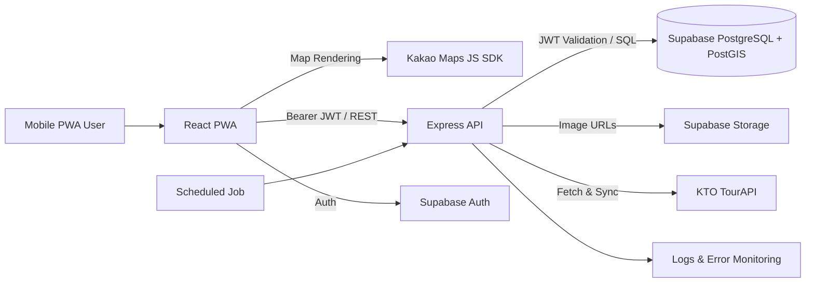
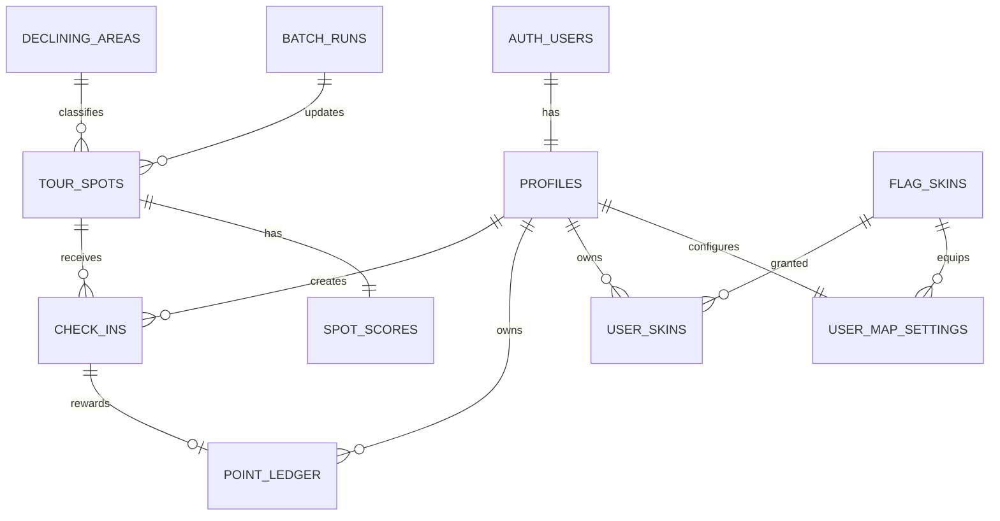

# Local Flag Project Planning and Development Specification

> Version: v0.1
> Date: 2026-08-16
> Audience: 1 Planning/Domain Lead, 1 Backend Engineer, 1 Frontend Engineer, 1 UI/UX Designer

## 0. Document Purpose and Writing Criteria

This document consolidates ideas, personas, UX specifications, data collection methods, and scoring policies related to the project from attached documents `1.pdf` and `Persona Ideas (1).docx`, re-organizing them into an MVP execution specification for Local Flag. Conversational request sentences or instructions with other purposes contained in the attached documents were not treated as project requirements.

In this document, items requiring agreement are marked as **Decision Needed**, and items deferred until after the MVP are marked as **Post-MVP**.

---

## 1. Project Overview

### 1.1 One-Sentence Introduction

Local Flag is a location-based tourism service that disperses tourist demand heavily concentrated in famous attractions by helping users discover lesser-known local spots, verify their physical presence on site, and receive points along with personalized flag records.

### 1.2 Problem Statement

* Search results focus heavily on sponsored content and famous tourist spots, making hidden places hard to find.
* Famous spots cause fatigue due to overcrowding, long waiting times, and price gouging.
* Frequent travelers lack motivations for collection and fresh destination options.
* Existing stamp tours offer one-off rewards, leading to weak motives for repeat visits.
* Population-depopulated areas and lesser-known tourism assets suffer from a lack of exposure to visitors.

### 1.3 Core Values

| User Value | Regional Value | Service Value |
| --- | --- | --- |
| Discovering tranquil spots, travel goals, fun of collecting, point rewards | Dispersing tourism demand, encouraging regional visits, exposing hidden assets | Cycle of Discovery → On-site Check-in → Record & Decorate → Next Discovery |

### 1.4 Product Principles

1. **Discovery First:** Instead of showing only the user's current location on the initial screen, allow users to explore hidden spots nationwide.
2. **On-Site Presence:** Points are awarded only for physical on-site visits verified by the server.
3. **Fairness:** Provide stronger incentives for quiet regions and hidden spots over famous and congested places.
4. **Persistence of Collection:** Save check-in results on a personal map and flag collection.
5. **Explainable Rewards:** Clearly display spot grades and the rationale behind point calculations so users can understand them.
6. **Minimal Location Data Collection:** Avoid continuous tracking; process location data only within the necessary scope at the moment of check-in.

---

## 2. Target Users and Core Scenarios

### 2.1 Priority Personas

#### Primary - Healing & Hipster Traveler Seeking Hidden Spots

* Example: Ayoung Kim, late 20s office worker
* Travels to the outskirts every weekend, preferring quiet, atmospheric local spots over crowded hot spots.
* Tired of sponsored blog posts and repetitive recommendations of famous attractions.
* Opens the app at home or work before traveling to explore destinations nationwide.
* Wants to decorate and share visit records using aesthetic maps and flags.

#### Secondary - "Stamp-Rally" Collector Traveler

* Has already visited many famous tourist spots and needs new travel goals.
* Responds enthusiastically to collection elements such as rare spots, regional completion, and flag collections.

#### Tertiary - Benefit-Focused Frugal Traveler

* Actively utilizes points, stamp tours, and local perks.
* Loses motivation to use the app continuously if rewards are small or single-use.

### 2.2 Core User Journey

1. User discovers hidden spots on a nationwide map or recommendation list.
2. User checks detailed information, spot grade, expected reward, and operating details.
3. User arrives at the destination and opens the On-Site Check-in tab.
4. User passes the 100m check-in radius and GPS accuracy verification.
5. Server checks for fraudulent activities such as duplication, impossible speed, and daily caps.
6. Upon successful check-in, points are credited to the ledger and a default flag is placed on the map.
7. User customizes records in My Flag and explores the next recommended spot.

---

## 3. MVP Scope

### 3.1 Must Have

* Supabase Auth-based Sign-up, Login, and Logout
* Exploration screen toggling between a nationwide map and recommendation list
* Spot pins, search/filtering, and detailed info
* Current location permission and display of nearby eligible check-in spots
* 100m radius on-site check-in
* Spot grade and visit reward point calculations
* Point balance and transaction history
* My Flag map displaying visited spots
* Selection and equipping of default flag skins
* TourAPI ingestion, cleaning, and scoring batch pipeline
* Basic anti-abuse logic and audit logging
* Fallback UI for spots lacking images

### 3.2 Out of Scope (MVP)

* Real local currency conversion and cash withdrawals
* Continuous GPS tracking and movement route storage
* Integration with external real-time floating population/congestion APIs
* Rooting/jailbreak detection (difficult to implement reliably on PWA)
* Team battles, real-time rankings, and social feeds
* Municipal/brand-sponsored pin management console
* Push notifications, extended stay bonuses, and accommodation links
* Functionality allowing users to create custom pins on arbitrary non-tourist spots

### 3.3 MVP Success Metrics

| Metric | Definition | Initial Target |
| --- | --- | --- |
| Discovery Activation Rate | Percentage of users viewing a spot detail page at least once within 24h of sign-up | $\ge 60\%$ |
| Check-in Success Rate | Percentage of check-in attempts that succeed normally | $\ge 80\%$ |
| Hidden Spot Visit Ratio | Ratio of check-ins at depopulated areas or B/A/S grade spots | $\ge 40\%$ |
| 7-Day Retention Rate | Percentage of users returning within 7 days after their first check-in | $\ge 25\%$ |
| Fraudulent Point Rate | Percentage of points identified as fraudulent upon post-audit | $< 1\%$ |
| API Performance | p95 response time for key retrieval APIs | $\le 800\text{ms}$ |

---

## 4. Information Architecture and Key Screens

### 4.1 Bottom 3 Tabs

| Tab | Purpose | Key Features |
| --- | --- | --- |
| Exploration `Discovery` | Discovering destinations before traveling | Nationwide map, map/list toggle, search, category/grade/region filters, recommended spots |
| On-site Check-in `Check-in` | Proving visit after arriving at destination | Current location-centered map, highlighted check-in eligible pins, distance/GPS status, check-in button |
| My Flag `My Flag` | Managing records and rewards | Visit map, point balance/history, flag skins, visit collection |

### 4.2 Screen List

| ID | Screen | Key States & Exceptions |
| --- | --- | --- |
| A-01 | Onboarding / Login | Login failure, terms consent, location permission prompt |
| D-01 | Nationwide Discovery Map | Loading, no pins, map viewport change, clustering, API error |
| D-02 | Recommendation List | No filter results, image fallback, infinite scroll |
| D-03 | Spot Detail | Closed/Out of operation, season pin pending/expired, expected reward, directions |
| C-01 | Check-in Map | Location permission denied, low GPS accuracy, out of range, already checked in |
| C-02 | Check-in Result | Success animation, earned points, non-rewarded repeat visit, pending review |
| M-01 | My Flag Map | Empty state, visit pins, equipped skin, filters |
| M-02 | Point History | Earned/Deducted/Canceled, pagination |
| M-03 | Flag Skins | Owned/Unowned, purchase, equip, insufficient balance |

### 4.3 Key UX Rules

* The initial screen opens with nationwide exploration; a separate "move to current location" button is provided.
* The map and list share the same filter states.
* When entering the check-in radius, pins and buttons are simultaneously highlighted using color, vibration, and text.
* On check-in failure, instead of showing just "Failed," display remaining distance, GPS accuracy, and retry instructions.
* Disclose spot grades and expected point calculations via tooltips or bottom sheets.
* Avoid rendering too many custom overlays at once; apply zoom-level clustering.

---

## 5. Recommended Tech Stack and System Architecture

### 5.1 Tech Stack

| Domain | Choice | Role |
| --- | --- | --- |
| Frontend | React + Vite + TypeScript | Mobile-first responsive PWA |
| UI | Tailwind CSS + Lucide Icons | Shared components and iconography |
| Server State | TanStack Query | API caching, retries, loading states |
| Client State | Zustand | Map mode, filters, transient UI state |
| Map | Kakao Maps JavaScript SDK | Map rendering, custom overlays, location markers |
| Backend | Node.js + Express + TypeScript | REST API, validation, point transactions, batch processing |
| Database | Supabase PostgreSQL + PostGIS | Auth-linked data, spatial queries, point ledger |
| Auth / Storage | Supabase Auth + Storage | User auth, flag/fallback image hosting |
| External Data | Korea Tourism Organization TourAPI (National Tourism Info) | POI data, details, images, event data |
| Deployment | Vercel (FE) + Render (BE) | HTTPS deployment & Git integrations |
| Contract / Test | OpenAPI 3.1 + Vitest + Supertest | FE/BE contract, unit/integration testing |

> Note: If the team's Python proficiency is significantly higher, Express can be swapped for FastAPI. However, since a single backend developer will manage operations, do not mix Express and FastAPI during MVP development.

### 5.2 Logical Architecture



### 5.3 Design Principles

* Store TourAPI authentication keys and Supabase service role keys strictly on the backend.
* The frontend must perform spot queries and check-ins exclusively through the Local Flag API.
* Point modifications must be recorded in `point_ledger` using an append-only approach without direct balance edits.
* Location comparisons and radius searches must utilize PostGIS `geography(Point, 4326)` and GiST indexes.
* All timestamps must be stored in UTC in the DB and rendered in KST on the UI.
* Preserve raw external API responses in `raw_json`, but query normalized columns for core service logic.

---

## 6. TourAPI Data Pipeline

### 6.1 Official Operations

While initial sections of reference materials mix `areaBasedList1` and `locationBasedList1`, implementation standards adopt the current publicly available `*2` operations on the Public Data Portal:

* List: `areaBasedList2` or `areaBasedSyncList2` for change synchronization
* Location-based verification: `locationBasedList2`
* Common info: `detailCommon2`
* Intro info: `detailIntro2`
* Additional info: `detailInfo2`
* Images: `detailImage2`
* Events/Festivals: `searchFestival2`

### 6.2 Target Content Types

| contentTypeId | Category | MVP Handling |
| --- | --- | --- |
| 12 | Tourist Spot | Core Pin |
| 14 | Cultural Facility | Core Pin |
| 15 | Festival / Event | Seasonal Pin |
| 28 | Leports | Experiential Pin |
| 32 | Accommodation | Informational; MVP point eligibility **Decision Needed** |
| 38 | Shopping | Auxiliary Pin; Initial map visibility **Decision Needed** |
| 39 | Restaurant | Auxiliary Pin; requires regional/quantity throttling |
| 25 | Travel Course | Excluded from MVP (does not match single-coordinate check-ins) |

### 6.3 Ingestion & Data Cleaning Steps

1. Ingest category lists page by page.
2. Execute UPSERT using `contentid` as PK.
3. Set status to `INACTIVE` if `mapx` or `mapy` are null, empty, or 0.
4. Segregate coordinates falling outside latitude 33.0–39.0 or longitude 124.0–132.0 for inspection.
5. Fetch detailed information and images; store them in normalized columns and `raw_json`.
6. Calculate spot score grades and determine map visibility status.
7. Store festival start and end dates separately to manage their lifecycle.

### 6.4 Synchronization Schedule

| Data Type | Schedule | Method |
| --- | --- | --- |
| General Spots | Monthly (Off-peak / Early morning) | Sync changes via `areaBasedSyncList2` |
| Festivals / Events | Weekly (Off-peak / Early morning) | Update start/end dates via `searchFestival2` |
| Failure Retry | Post-batch execution | Exponential backoff, up to 3 retries, dead-letter logging |

### 6.5 Seasonal Pin Lifecycle

| Timing | Status | Behavior |
| --- | --- | --- |
| D-3 to D-1 | `SCHEDULED` | Teaser pin displayed; check-in disabled |
| D-Day to End Date | `ACTIVE` | Seasonal pin check-in and bonuses enabled |
| End Date + 1 Day | `EXPIRED` | Hidden from default map; new check-ins disabled |

---

## 7. Scoring and Reward Point Policies

Reference materials sometimes use "score" to describe both spot valuation and user rewards. For proper accounting and balancing, these two concepts are separated in the implementation.

### 7.1 Spot Score $\text{spot\_score}$

A static value calculated by background batch processes using spot metadata. Used for map emphasis, grading, and recommendations—not equivalent to user point balance.

$$\text{spot\_score} = (100 \times W_{\text{category}}) \times (1 + W_{\text{media}} + W_{\text{detail}} + W_{\text{class}})$$

#### Category Weights

| Category | $W_{\text{category}}$ |
| --- | --- |
| Festival / Event | 2.0 |
| Tourist Spot | 1.5 |
| Cultural Facility | 1.3 |
| Leports | 1.2 |
| Accommodation | 0.8 |
| Shopping | 0.6 |
| Restaurant | 0.5 |

#### Metadata Bonuses

* $W_{\text{media}}$: Main image +0.15, additional thumbnails +0.05
* $W_{\text{detail}}$: 5+ detail fields +0.20, 3–4 fields +0.10, $\le 2$ fields 0
* $W_{\text{class}}$: Designated Cultural Heritage / National Park / UNESCO +0.20, specialized regional asset +0.10, general 0

#### Spot Grades

| Score Range | Grade | Map Representation |
| --- | --- | --- |
| $\ge 200$ | S | Highlighted rarest pin |
| 130–199 | A | High-value pin |
| 80–129 | B | Standard pin |
| $< 80$ | C | Auxiliary pin |

### 7.2 Visit Reward Points $\text{reward\_points}$

A dynamic value calculated server-side during on-site check-in.

$$\text{reward\_points} = \text{clamp}(\text{round}(100 \times W_{\text{area}} \times W_{\text{quiet}}), 10, 500)$$

| Factor | Value | MVP Criteria |
| --- | --- | --- |
| $W_{\text{area}}$ | 1.0 / 1.5 / 2.5 | Metropolitan Area / General Province / Verified Depopulated Area |
| $W_{\text{quiet}}$ | 0.1 / 1.0 / 2.0 | Quantile rank of check-in counts in region/category over last 30 days |

* Since real-time floating population APIs are absent, Local Flag uses internal check-in counts over the past 30 days as a proxy for "tranquility".
* New spots lacking historical data default to $W_{\text{quiet}} = 1.0$.
* Response payloads must include calculation factors and applied weights before granting points to users.
* Extended stay bonuses pose privacy, battery consumption, and abuse risks, and are deferred to Post-MVP experiments.

### 7.3 Earning Limits

* Base points are granted only for a user's first successful check-in at a specific spot.
* Repeat visits can be recorded, but yield 0 base points, unless explicitly allowed by a seasonal event.
* Daily cap: maximum 10 rewarded check-ins and 5,000 points per user per day.
* All point accruals and cancellations are recorded as unique transactions in `point_ledger`.
* When policies change, existing transactions are never modified; corrective transactions are added instead.

---

## 8. On-Site Check-in and Anti-Abuse Controls

### 8.1 Check-in Inputs

* `spotId`
* Latitude and Longitude
* Browser-provided `accuracyM`
* Client-side measurement timestamp
* `Idempotency-Key` to prevent accidental resubmissions

### 8.2 Server Validation Sequence

1. Validate JWT and user account status.
2. If `Idempotency-Key` is duplicated, return the original response.
3. Verify the spot is `ACTIVE` and belongs to an eligible category.
4. Verify location measurement is fresh and `accuracyM <= 50`.
5. Check if distance to spot center is $\le 100\text{m}$ using PostGIS `ST_DWithin`.
6. Verify first-time reward eligibility, 5-minute cooldown, and daily count/point caps.
7. Calculate movement speed from prior check-in; verify speed does not exceed 120 km/h.
8. If risk signals are low, commit check-in and ledger records in a single DB transaction.
9. If risk score is borderline, save check-in as `REVIEW` state without immediate point grant.

### 8.3 Risk Signals and Actions

| Code | Condition | Action / Response |
| --- | --- | --- |
| `GPS_INACCURATE` | Accuracy $> 50\text{m}$ | Prompt user to re-measure GPS |
| `OUT_OF_RANGE` | Distance $> 100\text{m}$ from spot | Show remaining distance to spot |
| `COOLDOWN` | $< 5\text{min}$ since last check-in | Return timestamp when eligible to retry |
| `IMPOSSIBLE_SPEED` | Calculated speed $> 120\text{km/h}$ | Flag for `REVIEW` or process without reward |
| `DAILY_CAP` | Exceeds daily count or point limit | Record visit; award 0 points |
| `ALREADY_REWARDED` | Points already granted for spot | Record repeat visit; award 0 points |

> Web browser GPS alone cannot entirely prevent Fake GPS attacks. MVP focuses on soft validation and audit logs to minimize false positives, without automated permanent bans.

---

## 9. Data Model

### 9.1 Entity Relationship Diagram



### 9.2 Key Tables

#### `profiles`

* `id uuid PK/FK -> auth.users.id`
* `nickname varchar(30)`
* `point_balance int` - cached sum of ledger, updated only within transactions
* `status enum(ACTIVE, SUSPENDED, DELETED)`
* `created_at`, `updated_at`

#### `tour_spots`

* `content_id bigint PK`
* `content_type_id smallint`
* `title`, `address`, `image_url`, `thumbnail_url`
* `location geography(Point, 4326)` + GiST index
* `area_code`, `sigungu_code`
* `is_declining_area boolean`
* `status enum(SCHEDULED, ACTIVE, INACTIVE, EXPIRED)`
* `event_start_date`, `event_end_date`
* `raw_json jsonb`
* `synced_at`, `created_at`, `updated_at`

#### `spot_scores`

* `content_id PK/FK`
* `category_weight`, `media_weight`, `detail_weight`, `class_weight`
* `spot_score numeric`, `grade char(1)`
* `quiet_weight numeric`
* `score_version varchar(20)`
* `calculated_at`

#### `declining_areas`

* `id uuid PK`
* `area_name`, `sigungu_name`
* `tour_area_code`, `tour_sigungu_code`
* `effective_from`, `effective_to`
* `source`, `verified_at`
* unique(`tour_area_code`, `tour_sigungu_code`, `effective_from`)

#### `check_ins`

* `id uuid PK`
* `user_id`, `content_id`
* `location geography(Point, 4326)`
* `accuracy_m numeric`, `distance_m numeric`
* `client_captured_at`, `created_at`
* `status enum(SUCCESS, REVIEW, REJECTED)`
* `risk_code`, `risk_score`
* `reward_points int`
* `idempotency_key varchar(100)`
* unique(`user_id`, `idempotency_key`)

#### `point_ledger`

* `id uuid PK`
* `user_id`, `check_in_id nullable`
* `type enum(CHECK_IN, PURCHASE, REVERSAL, ADMIN_ADJUSTMENT)`
* `amount int` - positive for rewards, negative for usage/cancellation
* `balance_after int`
* `policy_version varchar(20)`
* `metadata jsonb`
* `created_at`

#### `flag_skins`, `user_skins`, `user_map_settings`

* Skin price, asset URL, active status
* User-owned skins and acquisition time
* Currently equipped skin, map theme

#### `batch_runs`

* Batch type, start/end time, success/failure counts, cursor, error summary

### 9.3 Integrity Constraints

* Point grants and `point_balance` updates must be executed within the same DB transaction.
* Initial check-in rewards are enforced via a partial unique index: prevent duplicate `(user_id, content_id)` for successful base rewards.
* Enforce check constraints: `point_balance >= 0`, `reward_points >= 0`, `accuracy_m > 0`.
* Retention period for raw check-in coordinates is **Decision Needed**; default proposal is grid-anonymization or purging after 90 days.

---

## 10. Local Flag REST API

### 10.1 General Conventions

* Base URL: `/api/v1`
* Authentication: `Authorization: Bearer <Supabase access token>`
* Content Type: `application/json`
* Check-in / Purchase requests: `Idempotency-Key` required
* Pagination: `cursor` and `limit` pattern
* Coordinate ordering: API objects use `lat`, `lng`; DB Point constructors require `lng lat`.
* Successful responses wrap data in `data`, list metadata in `meta`.
* Error responses provide stable `code`, user-facing `message`, and tracking `traceId`.

```json
{
  "error": {
    "code": "OUT_OF_RANGE",
    "message": "You are 136m away from the check-in point.",
    "details": { "distanceM": 136, "allowedRadiusM": 100 },
    "traceId": "req_01J..."
  }
}

```

### 10.2 Endpoint Summary

#### System & User

| Method | Path | Auth | Description |
| --- | --- | --- | --- |
| GET | `/health` | No | Server & DB health status |
| GET | `/me` | Yes | User profile, point balance, equipped skin |
| PATCH | `/me` | Yes | Update profile (e.g., nickname) |
| GET | `/me/point-ledger` | Yes | Point earning & spending history |
| GET | `/me/check-ins` | Yes | My check-in history |

#### Spot Discovery

| Method | Path | Auth | Description |
| --- | --- | --- | --- |
| GET | `/spots` | Optional | Map bbox or region/filter-based spot list |
| GET | `/spots/{spotId}` | Optional | Spot details, grade, expected rewards |
| GET | `/spots/recommendations` | Optional | Recommended hidden spots list |
| GET | `/spots/nearby` | Yes | Nearby check-in eligible spots |

`GET /spots` Key Query Parameters:

* `minLat`, `minLng`, `maxLat`, `maxLng` - Map viewport
* `contentTypeIds=12,14,15,28`
* `grades=S,A,B`
* `decliningArea=true|false`
* `q`, `areaCode`, `sigunguCode`
* `cursor`, `limit`

Sample Response:

```json
{
  "data": [
    {
      "id": 125266,
      "title": "Tranquil Local Spot",
      "contentTypeId": 12,
      "location": { "lat": 34.771, "lng": 127.081 },
      "grade": "A",
      "isDecliningArea": true,
      "estimatedReward": 250,
      "imageUrl": null,
      "status": "ACTIVE"
    }
  ],
  "meta": { "nextCursor": "eyJpZCI6...", "hasNext": true }
}

```

#### On-Site Check-in

| Method | Path | Auth | Description |
| --- | --- | --- | --- |
| POST | `/check-ins/precheck` | Yes | Pre-verify distance, GPS, caps; no point grant |
| POST | `/check-ins` | Yes | Final server validation, check-in & point transaction |
| GET | `/check-ins/{checkInId}` | Yes | Query check-in processing status |

`POST /check-ins` Request Body:

```json
{
  "spotId": 125266,
  "position": {
    "lat": 34.771123,
    "lng": 127.081234,
    "accuracyM": 18.4,
    "capturedAt": "2026-08-16T03:20:10.000Z"
  }
}

```

Success Response:

```json
{
  "data": {
    "checkInId": "8a0de7de-1d94-4ff1-9f47-4d95e7f3aa42",
    "status": "SUCCESS",
    "distanceM": 42.7,
    "reward": {
      "points": 250,
      "balance": 1250,
      "factors": {
        "base": 100,
        "areaWeight": 2.5,
        "quietWeight": 1.0
      },
      "policyVersion": "reward-v1"
    },
    "flag": { "placed": true, "skinId": "default-red" }
  }
}

```

#### Flag & Customization

| Method | Path | Auth | Description |
| --- | --- | --- | --- |
| GET | `/flag-skins` | Yes | List skins with purchase/ownership status |
| POST | `/flag-skins/{skinId}/purchase` | Yes | Purchase skin with points |
| PUT | `/me/equipped-flag-skin` | Yes | Equip primary flag skin |
| GET | `/me/map` | Yes | Fetch user's visit pins and equipped skin |

#### Internal Batch & Operations

| Method | Path | Caller | Description |
| --- | --- | --- | --- |
| POST | `/internal/jobs/tour-spots/sync` | Scheduler | Sync TourAPI changes |
| POST | `/internal/jobs/festivals/sync` | Scheduler | Refresh seasonal pins |
| POST | `/internal/jobs/spot-scores/recalculate` | Scheduler/Admin | Recalculate spot scores |
| POST | `/internal/check-ins/{id}/review` | Admin | Approve/Reject pending check-ins |

Internal APIs must be protected by dedicated cron secrets or admin service accounts rather than public user JWTs.

### 10.3 Status Codes

| HTTP | Usage |
| --- | --- |
| 200 | Successful query or idempotent retry |
| 201 | Successful check-in or purchase creation |
| 400 | Malformed payload / request format error |
| 401 | Missing or expired authentication token |
| 403 | Suspended user or forbidden internal API access |
| 404 | Spot or check-in record not found |
| 409 | Duplicate check-in, already rewarded, or state conflict |
| 422 | GPS accuracy, range, or policy rule validation failed |
| 429 | Rate limit or daily check-in cap exceeded |
| 502/503 | External API failure or temporary service degradation |

### 10.4 API Contract Management

* Backend leads ownership of `openapi.yaml`.
* Frontend reviews schema and error codes prior to API implementation.
* Planning/Domain Lead approves point calculations, state transitions, and text semantics.
* UI/UX defines user messages and recovery flows for each error code.
* Contract modifications require merging the OpenAPI PR first, followed by updates to mock APIs and client type definitions.

---

## 11. Collaboration Structure

### 11.1 Roles and Responsibilities

| Role | Primary Responsibility | Key Deliverables | Final Approval Area |
| --- | --- | --- | --- |
| Planning / Domain Lead | Problem definition, policies, data criteria, schedule/risks, presentation | PRD, region weighting maps, policy tables, acceptance criteria, deck | Scope, point policy, categories, priorities |
| Backend Engineer | API, DB, TourAPI, batch processing, location/abuse validation | OpenAPI spec, migrations, batch jobs, test suite, operational logs | Data & API implementation |
| Frontend Engineer | PWA, map rendering, location permissions, API integration, state management | React app, map/list/check-in screens, FE tests | Client implementation |
| UI/UX Designer | User journeys, wireframes, design system, asset creation | Figma files, prototypes, marker/fallback/skin assets | Visual and interaction quality |

### 11.2 RACI Matrix

| Task | Planning / Domain | BE | FE | UI/UX |
| --- | --- | --- | --- | --- |
| MVP Scope & Priorities | A/R | C | C | C |
| Depopulated Area Mapping | A/R | C | I | I |
| Spot & Point Policies | A/R | C | C | C |
| OpenAPI & DB Schema | C | A/R | C | I |
| TourAPI Pipeline | C | A/R | I | I |
| Map & Location UX Implementation | C | C | A/R | C |
| Wireframes & Design System | C | I | C | A/R |
| Integration Testing | A | R | R | C |
| Demo & Presentation | A/R | C | C | R |

`R`: Responsible (Execution), `A`: Accountable (Final approval), `C`: Consulted, `I`: Informed

### 11.3 Workflow

1. Planning/Domain creates issues with user stories and acceptance criteria.
2. UI/UX attaches wireframes covering major states and edge cases.
3. BE and FE review the API contract and finalize `openapi.yaml` first.
4. Parallel development proceeds: BE develops actual APIs, FE develops against mock APIs.
5. Feature branch PRs pass automated tests and cross-peer reviews.
6. Verification of normal and failure scenarios occurs in the integration environment.
7. Planning/Domain verifies acceptance criteria and moves issues to Done.

### 11.4 Git & Issue Guidelines

* Keep `main` in a deployable state at all times.
* Use short-lived feature branches: `feat/check-in`, `fix/map-cluster`, `docs/api-contract`.
* PRs require approval from at least 1 relevant peer reviewer.
* API PRs require FE review; major UX PRs require UI/UX review.
* Commit message convention: `feat(check-in): add geofence validation`.
* Issue workflow states: `Backlog → Ready → In Progress → Review → QA → Done`.
* Document policy decisions in `docs/decisions/ADR-xxx.md` or issue threads, not just chat logs.

### 11.5 Meeting Cadence

| Cycle | Meeting | Duration | Purpose |
| --- | --- | --- | --- |
| Daily | Async Standup | 5 min | Share yesterday/today/blockers |
| 2x / Week | Integration Check | 30 min | Verify actual connection of API, UI, and data |
| Weekly | Sprint Planning & Review | 60 min | Scope adjustment, demo, next targets |
| As Needed | Policy Decision Session | Cap 20 min | Resolve 1 open policy issue with evidence |

### 11.6 Definition of Ready

* User value and priority are clearly defined.
* Happy path and at least 3 exception flows are documented.
* API schema or design link is attached.
* Acceptance criteria are written in Given/When/Then format or checklist.
* External API keys and sample data dependencies are prepared.

### 11.7 Definition of Done

* Implementation and code review are completed.
* Unit and integration tests pass.
* Verified on a physical mobile device over HTTPS.
* Verified loading, empty, error, and permission-denied UI states.
* No sensitive data (e.g., tokens, raw GPS) leaked in logs.
* OpenAPI, policy documents, or Figma assets updated to reflect changes.
* Passed acceptance criteria check by Planning and visual inspection by UI/UX.

---

## 12. 3-Week MVP Roadmap

### Prerequisites (Days 1–2)

* Team: Apply for TourAPI keys and verify `*2` operations API calls.
* Planning: Draft initial mapping of depopulated areas $\leftrightarrow$ `areaCode`/`sigunguCode`.
* BE: Set up Supabase project, PostGIS extension, base migrations, and OpenAPI skeleton.
* FE: Configure Kakao Maps API key and verify mobile HTTPS geolocation.
* UI/UX: Design core journey, 3-tab wireframes, fallback images, and marker specs.

### Week 1 - Data & Discovery Foundation

* BE: Implement TourAPI ingestion, coordinate cleaning, populate `tour_spots` & `spot_scores`.
* FE: Build PWA skeleton, Auth flow, nationwide map, bbox spot queries.
* UI/UX: Finalize UI states for Discovery, Detail, and Check-in screens.
* Planning: Finalize categories, depopulated area mappings, Grade/Point policy v1.
* Integration Goal: Real TourAPI spots render accurately on the map and recommendation list.

### Week 2 - Check-in & Points

* BE: Build `/check-ins`, PostGIS distance verification, idempotency, point ledger, risk checks.
* FE: Implement location permissions, nearby pins, precheck API, check-in modal, point history.
* UI/UX: Create success/failure/pending animations and guidance microcopy.
* Planning: Author QA test cases covering valid, invalid, and boundary scenarios.
* Integration Goal: Complete a 100m check-in and point grant on a physical smartphone.

### Week 3 - My Flag & Stabilization

* BE: Implement flag skin APIs, festival sync batch, operational logging.
* FE: Build My Flag screen, skin store/equipping, map performance optimizations.
* UI/UX: Conduct visual QA on final assets, empty states, and demo flow.
* Planning: Write presentation and demo script backed by data and impact metrics.
* Integration Goal: Demonstrate the complete end-to-end loop (Discovery $\rightarrow$ Check-in $\rightarrow$ Point Reward $\rightarrow$ Flag Customization) within 3 minutes.

---

## 13. Testing Strategy

### 13.1 Mandatory Test Cases

* Unit tests for scoring and point formula boundary values.
* Duplicate submission tests using `Idempotency-Key`.
* Race condition testing for simultaneous check-ins by the same user/spot.
* Boundary distance tests at 99m / 100m / 101m.
* GPS accuracy boundary tests at 49m / 50m / 51m.
* Daily cap and date rollover tests (UTC / KST logic).
* Handling TourAPI missing fields, null images, and invalid coordinates.
* Festival lifecycle transition testing (`SCHEDULED` $\rightarrow$ `ACTIVE` $\rightarrow$ `EXPIRED`).
* Mobile rendering performance tests with 50–100 custom markers.
* UX resilience tests for location permission denial, network disconnects, and token expirations.

### 13.2 Field Testing for Demo

* Verify on at least 2 physical mobile devices using the deployed HTTPS URL.
* Test both success (inside 100m) and failure (outside 100m) at 1 target location.
* Verify user guidance text in dense urban/indoor settings with high GPS variance.
* Test offline/degraded mode to confirm discovery works with cached data during external API outages.

---

## 14. Security, Privacy, and Operations

* Explain data usage purpose and storage scope before requesting location permissions.
* Store precise check-in coordinates only for the duration required for point verification; do not send raw coordinates to analytics events.
* Mask access tokens, API keys, service role keys, and high-precision GPS data in logs.
* Enable Supabase Row Level Security (RLS) so users can only access their own profiles, check-ins, and ledger entries.
* Apply per-user rate limiting on check-in and purchase APIs.
* Restrict Kakao JS API keys to authorized domain origins; keep TourAPI keys strictly on the backend.
* Maintain accounting integrity: issue reversal transactions rather than modifying or deleting ledger entries.
* Monitor batch job execution logs and external API error rates.
* Perform a legal review regarding privacy policies, location service disclosures, and user consents prior to public release.

---

## 15. Risk Management

| Risk | Impact | Mitigation Strategy |
| --- | --- | --- |
| TourAPI key approval / quota delay | Development bottleneck | Apply on Day 1, store sample responses, design with caching & batch focus |
| API operation version mismatch | 404 / schema errors | Standardize on `*2` adapter interfaces and contract tests |
| GPS variance / Fake GPS spoofing | False check-ins / user complaints | Implement accuracy/distance/speed check, `REVIEW` status, recovery UX |
| High proportion of null spot images | Poor discovery visual quality | Provide branded fallback assets; adjust ranking/filters for imageless spots |
| Excessive map markers rendering | Mobile frame drop | Viewport bbox queries, clustering, zoom-based lazy loading, performance budget |
| Single backend developer bottleneck | Integration delays | Contract-first workflow, single stack, parallel development with mock APIs |
| Overly complex scoring rules | Difficult to explain to users | Separate spot score from reward points; maintain policy versioning |
| Expectations of cash-like rewards | Legal & financial overhead | Limit MVP to in-app reward points; validate local currency integration via partners |

---

## 16. Action Items Requiring Decision Before Implementation

* [ ] Scope of eligible check-in/point spots regarding Accommodations, Shopping, and Restaurants.
* [ ] Cutoff date and ownership for updating the official Depopulated Areas list.
* [ ] Exception policy for repeat visit rewards at the same spot.
* [ ] Retention period and anonymization/grid-purging strategy for raw GPS records.
* [ ] Pricing structure for flag skins and initial welcome point allocation.
* [ ] Recommendation algorithm v1: weighting factors for rule-based scoring.
* [ ] Default map center region and target municipality for demo.
* [ ] Final confirmation of official English naming (`Local Flag`) and brand tone.

---

## 17. Official Technical References

* [Korea Tourism Organization Public Data Portal - National Tourism Information Service](https://www.google.com/search?q=https://www.data.go.kr/data/15101578/openapi.do)
* [Kakao Maps Web API Documentation](https://apis.map.kakao.com/web/documentation/)
* [Supabase PostGIS Geo Queries Guide](https://supabase.com/docs/guides/database/extensions/postgis)
* [Supabase Row Level Security (RLS) Overview](https://supabase.com/docs/guides/database/overview)